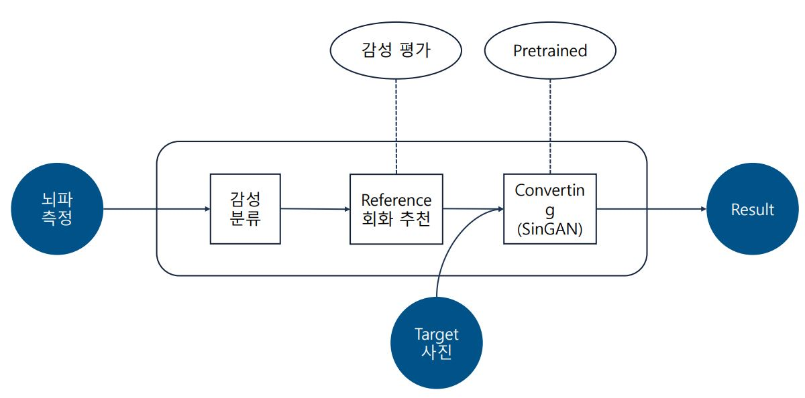
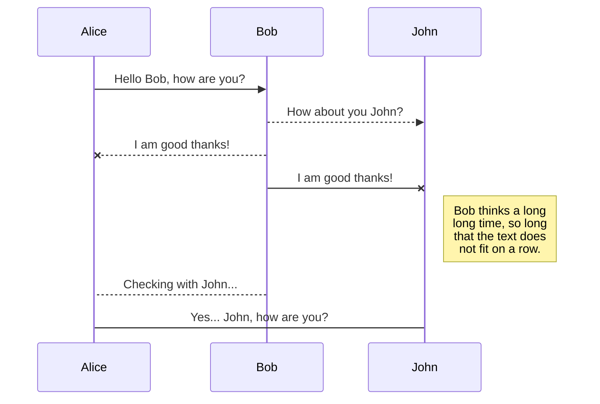
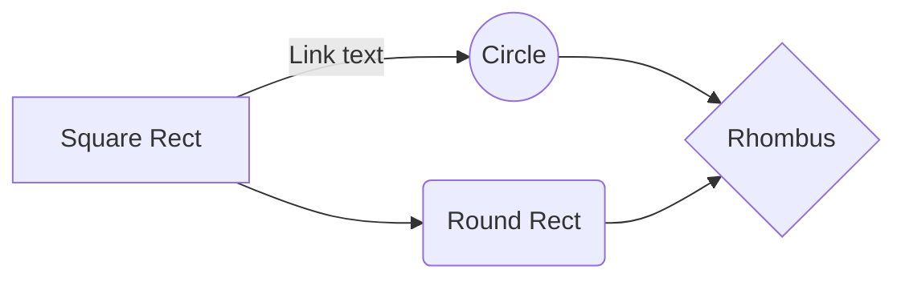

# Emotional classification and Painting rendering system based on Biological signals

[Paper](https://drive.google.com/file/d/10U2h2FI7Werj9rdcbjAglw2g9R5F3Yvl/view?usp=sharing) | [Project](https://drive.google.com/file/d/1KKKzKKXDGYLnVxo6IKglSMEkLFIPi1No/view?usp=sharing) | [Presentation](https://drive.google.com/file/d/1vdqw6_wS0JVksHec_CEPYjCppfYjO90Z/view?usp=sharing)

**This repository contains source codes which used for "Final Project for CUAI 3rd Conference".**

**CUAI 3rd Final Conference 1st place Award 🏆 (Grand Prize)**

Paper and Presentation are in Korean.

### Our Team 
 - **Byunghyun Bae** (School of Pharmaceutics, Chung-Ang Univ.)
 - **Hearyeon Seo** (School of Mechanical Engineering, Chung-Ang Univ.)
 - **Nahyuk Lee** (School of Computer Science & Engineering, Chung-Ang Univ.)
 - **Borim Lee** (School of Computer Science & Engineering, Chung-Ang Univ.)
 - **Hayun Lee** (School of Computer Science & Engineering, Chung-Ang Univ.)
 - **Whanjin Lee** (School of Energy Systems Engineering, Chung-Ang Univ.)

## System Flow
The system flow of our project is as follows. 

1) Measuring brain waves data and Emotional classification with them.
2) Recommending reference paintings according to the emotional evaluation results.
3) Rendering paintings for target image using [SinGAN](https://github.com/NahyukLEE/SinGAN).

## SmartyPants

SmartyPants converts ASCII punctuation characters into "smart" typographic punctuation HTML entities. For example:

|                |ASCII                          |HTML                         |
|----------------|-------------------------------|-----------------------------|
|Single backticks|`'Isn't this fun?'`            |'Isn't this fun?'            |
|Quotes          |`"Isn't this fun?"`            |"Isn't this fun?"            |
|Dashes          |`-- is en-dash, --- is em-dash`|-- is en-dash, --- is em-dash|

## KaTeX

You can render LaTeX mathematical expressions using [KaTeX](https://khan.github.io/KaTeX/):

The *Gamma function* satisfying $\Gamma(n) = (n-1)!\quad\forall n\in\mathbb N$ is via the Euler integral

$$
\Gamma(z) = \int_0^\infty t^{z-1}e^{-t}dt\,.
$$

> You can find more information about **LaTeX** mathematical expressions [here](http://meta.math.stackexchange.com/questions/5020/mathjax-basic-tutorial-and-quick-reference).

## UML diagrams

You can render UML diagrams using [Mermaid](https://mermaidjs.github.io/). For example, this will produce a sequence diagram:

And this will produce a flow chart:

