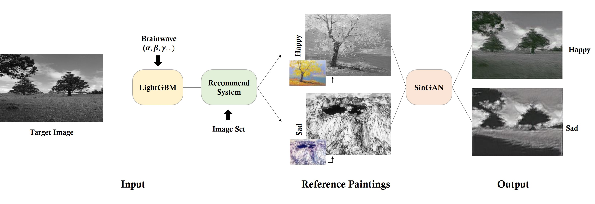

# Emotional classification and Painting rendering system based on Biological signals

[Paper](https://drive.google.com/file/d/10U2h2FI7Werj9rdcbjAglw2g9R5F3Yvl/view?usp=sharing) | [Project](https://drive.google.com/file/d/1KKKzKKXDGYLnVxo6IKglSMEkLFIPi1No/view?usp=sharing) | [Presentation](https://drive.google.com/file/d/1vdqw6_wS0JVksHec_CEPYjCppfYjO90Z/view?usp=sharing)

**This repository contains source codes which used for "Final Project for CUAI 3rd Conference".**

**CUAI 3rd Final Conference 1st place Award 🏆 (Grand Prize)**

Paper and Presentation are in Korean.

### Our Team 
 - Byunghyun Bae (School of Pharmaceutics, Chung-Ang Univ.)
 - Hearyeon Seo (School of Mechanical Engineering, Chung-Ang Univ.)
 - **Nahyuk Lee** 🙋‍♂️ (School of Computer Science & Engineering, Chung-Ang Univ.)
 - Borim Lee (School of Computer Science & Engineering, Chung-Ang Univ.)
 - Hayun Lee (School of Computer Science & Engineering, Chung-Ang Univ.)
 - Whanjin Lee (School of Energy Systems Engineering, Chung-Ang Univ.)


## Application
We use 2 emotion class *'happy'* and *'sad'* for test, and our System can generate paintings depend on user emotions.




## System Flow
The system flow of our project is as follows. 

### a) Recommending reference paintings using Euclidean Distance
Measuring brain waves data and Emotional classification with them. Recommending reference paintings according to the emotional evaluation results.


### b) Rendering using SinGAN example
Rendering paintings for target image using [SinGAN](https://github.com/NahyukLEE/SinGAN).


## Code

### Install dependencies
We recommend you to use Anaconda that already including mandotory packages. 
```
python -m pip install -r requirements.txt
```
Our code was tested with Python 3.6, Pytorch 1.7, CUDA 11.

### Train Emotional Classification Model
To train emotional classification models with your own brain waves dataset(*'ratio.csv'*), you can handle IPython notebook with *'model.ipynb'* . By using *dump* method in *joblib*, you can export your model as *'emotion_modle.pkl'*.

### Generating Paintings
Before you generating paintings, save your image under "SinGAN/Input/Paint", and run the command
```
python main.py
```

## References
- Tamar Rott Shaham, Tali Dekel, Tomer Michaeli "SinGAN: Learning a Generative Model from a Single Natural Image", ICCV 2019
- 'SinGAN' Github Repository (https://github.com/tamarott/SinGAN)
